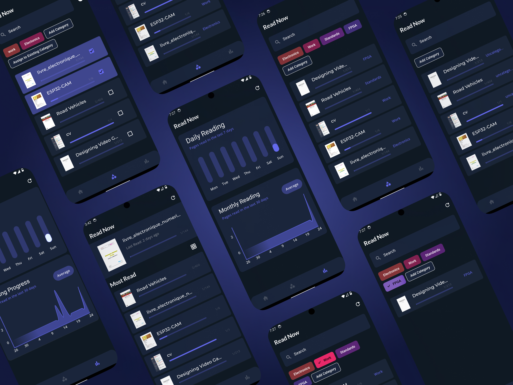

# ReadNow

ReadNow is a Flutter application that allows users to manage and read PDF documents. The app provides features such as categorizing documents, tracking reading progress, and viewing reading statistics.



## Features

- **Document Management**: Add, rename, and delete categories for organizing documents.
- **Reading Progress**: Track the last page read and the total pages read for each document.
- **Statistics**: View reading statistics including daily reading time and the number of pages read.
- **PDF Viewer**: Integrated PDF viewer with text selection and annotation capabilities.

## Installation

1. **Clone the repository**:
    ```sh
    git clone https://github.com/yourusername/readnow.git
    cd readnow
    ```

2. **Install dependencies**:
    ```sh
    flutter pub get
    ```

3. **Run the application**:
    ```sh
    flutter run
    ```

## Usage

### Home Page

The home page displays the most read documents and the last document read. You can refresh the document list by clicking the refresh icon in the app bar.

### Categories Page

The categories page allows you to manage document categories. You can add new categories, rename existing ones, and delete categories. Long press on a category to rename or delete it.

### Statistics Page

The statistics page displays reading statistics in the form of bar and line charts. It shows the daily reading time and the number of pages read.

### PDF Viewer

The PDF viewer allows you to read documents, select text, and add annotations. The viewer tracks your reading progress and updates the last page read.

## Project Structure

- **lib/pages**: Contains the main pages of the application (home, categories, statistics, preview).
- **lib/controller**: Contains the BLoC (Business Logic Component) files for managing the state of the application.
- **lib/model**: Contains the data models used in the application.
- **lib/utils**: Contains utility functions and widgets used across the application.

## Dependencies

- **flutter_bloc**: State management using BLoC pattern.
- **get**: Simplified navigation and state management.
- **shared_preferences**: Persistent storage for simple data.
- **syncfusion_flutter_pdfviewer**: PDF viewer for displaying and annotating PDF documents.
- **external_path**: Access external storage paths.
- **permission_handler**: Request and check permissions.

## Contributing

Contributions are welcome! Please fork the repository and submit a pull request for any improvements or bug fixes.

## License

This project is licensed under the MIT License. See the [LICENSE](LICENSE) file for details.